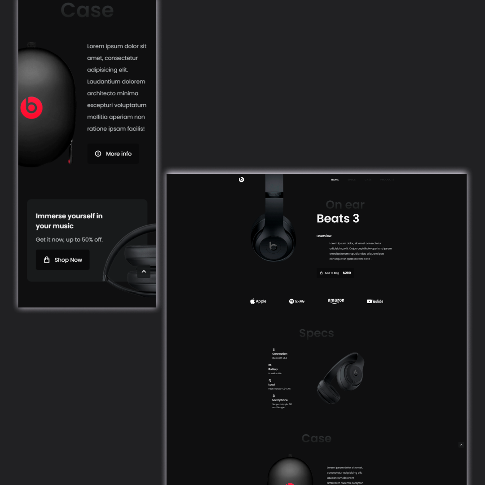

<h1 align="center">
    
</h1>

#Projeto

Pratincando front-end, revendo cosigo e boas peaticas de HTML, aprendendo novas propriedades e funções. Em uma landing page simples de Headphones,
Projeto feito no video <a href="https://www.youtube.com/watch?v=wXnlHIvKnTM">Video aula</a>.

##Tecnologias
-HTML
-CSS
-Javascript
